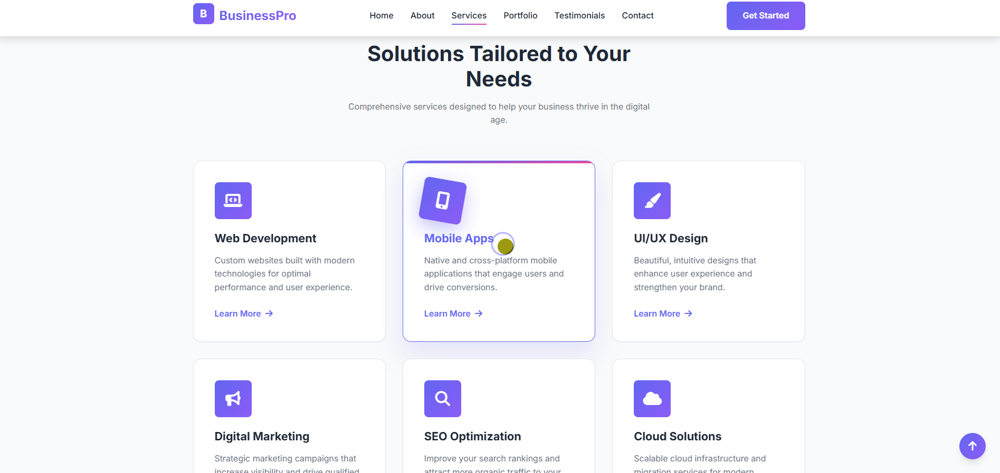
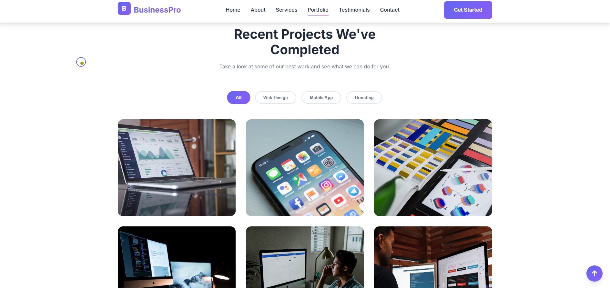
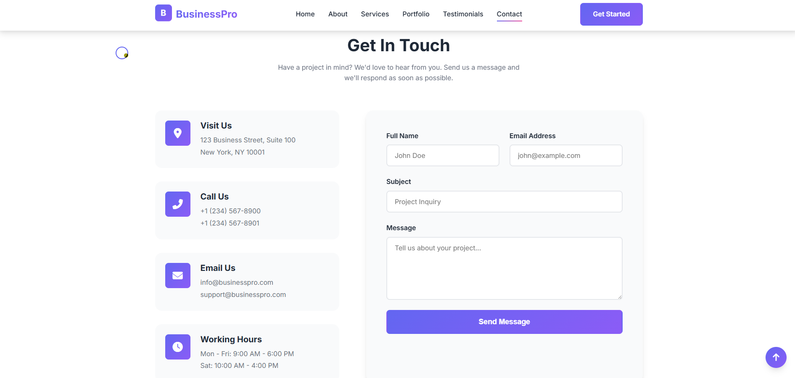
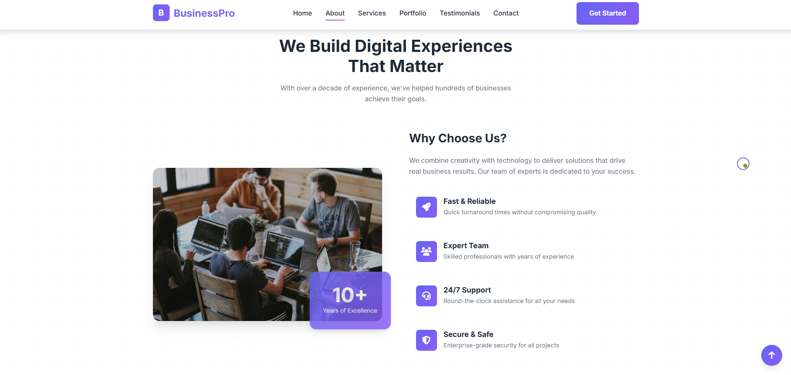

# BusinessPro Website Template

[](https://your-live-link.netlify.app)

A stunning, professional, and fully responsive business website template designed for agencies, startups, and service-based businesses. Features modern animations, particles effects, and a premium look.

**Live Demo:** (https://699c3b632f53322447838b4f--luxury-jalebi-95a055.netlify.app/)

## Screenshots

### Home Page - Hero Section


### Services Section


### Portfolio Showcase


### Contact Form


### About Section


---

## Features

### Design & Layout
- **Modern & Professional** design with premium aesthetics
- **Fully Responsive** (mobile, tablet, desktop)
- **Animated Preloader** with loading animation
- **Custom Cursor** for interactive experience
- **Particle Background** in hero section
- **Typing Animation** for dynamic text
- **Scroll-triggered Animations** throughout
- **Parallax Effects** for depth
- **Smooth Transitions** and micro-interactions

### Pages Included
1. **Homepage (index.html)**
   - Animated hero with particles & typing effect
   - About section with hover animations
   - Services grid with card hover effects
   - Portfolio with filter & overlay animations
   - Testimonials with auto-slider
   - Contact form with validation
   - Newsletter signup

2. **Services Page (services.html)**
   - Detailed service descriptions
   - Feature lists
   - Process workflow

3. **Pricing Page (pricing.html)**
   - Three-tier pricing cards
   - Monthly/yearly toggle
   - Feature comparison
   - FAQ section

### Technical Features
- Modern CSS with CSS Grid & Flexbox
- Vanilla JavaScript (lightweight)
- AOS Animation Library
- Particles.js for background effects
- Intersection Observer for scroll animations
- Custom cursor implementation
- Number counter animations
- Mobile-first responsive design
- SEO-friendly structure
- Form validation
- Smooth scrolling navigation
- Back-to-top button

## Quick Start

1. Clone or download the repository
2. Open `index.html` in your browser
3. Customize the content as needed

## File Structure
```
├── index.html          # Main homepage
├── services.html       # Services detail page
├── pricing.html        # Pricing plans page
├── css/
│   └── style.css      # Main stylesheet
├── js/
│   └── main.js        # JavaScript functionality
├── screenshots/      # Project screenshots
└── README.md          # Documentation
```

## Customization

### Changing Colors
Edit CSS variables in `css/style.css`:
```css
:root {
    --primary-color: #6366f1;     /* Main brand color */
    --primary-dark: #4f46e5;      /* Darker shade */
    --secondary-color: #ec4899;   /* Accent color */
    --accent-color: #8b5cf6;      /* Gradient end color */
}
```

### Changing Content
1. **Text**: Edit directly in HTML files
2. **Images**: Replace URLs in `src` attributes
3. **Logo**: Update in navbar and footer
4. **Contact Info**: Update in contact section

## Browser Support
- Chrome (latest)
- Firefox (latest)
- Safari (latest)
- Edge (latest)

## License
This template is ready to use for:
- Personal projects
- Commercial projects
- Client work
- Resale as part of projects

---

**Version:** 2.0 (Enhanced Edition)
**Created by:** BusinessPro Team
